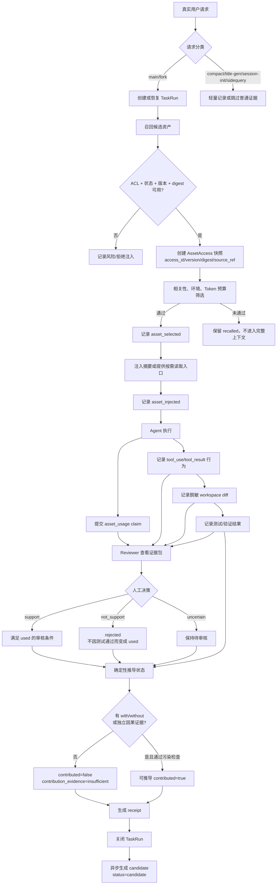

# Asset Evidence 审查 Demo 链路

这份文档只演示一个最小、可人工检查的闭环：

```text
一个真实任务
  → 读取一个 Skill 资产
  → Agent 声明使用
  → 关联工具行为、代码 diff、测试
  → Reviewer 审核
  → 生成 receipt 和 candidate
```

Demo 资产：`skill_retry`，版本 `3`，用途为 API retry/backoff。

## 1. Mermaid 总流程



## 2. 每一步的动作和检查

| 步骤 | 执行动作 | 必须检查 | 产生的事实/结果 |
|---|---|---|---|
| 1. 请求分类 | 识别 `main`、`fork`、`sidequery`、`compact`、`title-gen`、`session-init` | 只有 main/fork 创建普通 TaskRun | 任务类型、session/request/execution 上下文 |
| 2. 创建 TaskRun | 写入 team、agent、user、task goal、repo、branch、variant | 调用者权限；幂等键；run_id 服务端生成 | `task_run_started` |
| 3. 召回资产 | 调现有 Skill/Wiki/Code Graph/Memory 搜索 | ACL；允许的资产状态；必须取得 version 和 digest | `AssetAccess` + `asset_recalled` |
| 4. 选择资产 | 计算相关性、环境兼容性和 token 成本 | 未通过筛选的资产不能进入完整 Prompt | `asset_selected` 或风险/缺口 |
| 5. 注入上下文 | 注入摘要、适用范围、稳定 `access_id` 和读取入口 | 团队资料边界；不能覆盖 system instruction | `asset_injected` |
| 6. Agent 声明 | 解析 `<asset_usage>` JSON | schema_version；access_id 属于当前 run；purpose/file/decision 长度 | `agent_declared`；不能直接推导 used |
| 7. 行为采集 | 缓冲 Anthropic `tool_use` 和后续 `tool_result` | 工具名、目标文件、结果摘要脱敏；无退出码时为 unknown | `behavior_observed` |
| 8. Diff 采集 | 由 workspace hook 或关闭时 git 扫描生成 | 基线/head commit；文件列表；diff digest；无法访问时记录 unavailable | `diff_recorded` |
| 9. 验证 | 记录测试命令、退出码、通过状态 | 必须关联 claim、behavior 或 diff；孤立的通过测试不算资产验证 | `validation_recorded` |
| 10. 人工审核 | Reviewer 查看完整证据包并选择 support/not_support/uncertain | reviewer 权限；引用的行为/diff 属于同一 run | `review_recorded` |
| 11. 状态推导 | 服务端读取同一 access_id 的全部事实事件 | `used` 必须有 support + 关联证据；`contributed` 还需因果证据 | receipt revision |
| 12. 关闭和回流 | 关闭 run，生成回执和候选资产 | 关闭后普通事件拒绝；纠正只能追加；candidate 不自动 approved | `task_run_closed`、`candidate_generated` |

## 3. 最小 API 调用顺序

以下请求对应仓库中的 `MemoryCore/scripts/evidence-demo.ts`。

```text
POST /v3/evidence/task-runs
POST /v3/evidence/task-runs/{run_id}/accesses
POST /v3/evidence/task-runs/{run_id}/events          # asset_selected
POST /v3/evidence/task-runs/{run_id}/behaviors
POST /v3/evidence/task-runs/{run_id}/diffs
POST /v3/evidence/task-runs/{run_id}/claims
POST /v3/evidence/task-runs/{run_id}/validations
POST /v3/evidence/task-runs/{run_id}/reviews         # support
GET  /v3/evidence/task-runs/{run_id}/receipt
POST /v3/evidence/task-runs/{run_id}/close
```

Demo 中预期的关键结果是：

```json
{
  "recalled": true,
  "selected": true,
  "injected": true,
  "declared_used": true,
  "used": true,
  "validation_passed": true,
  "contributed": false,
  "contribution_evidence": "insufficient"
}
```

这里 `contributed=false` 是有意的：Demo 没有执行 with-assets/without-assets 对照实验，也没有独立因果证据。

## 4. Reviewer 在界面上应看到什么

审核卡片应展示“这一次使用关系”的证据，而不是只展示资产生命周期状态：

```text
资产：API Retry Skill
类型：skill
版本：3
digest：sha256:...
来源：...
access_id：acc_...

阶段：召回 ✓  筛选 ✓  注入 ✓
Agent 声明：used
用途：确定 API retry 退避策略
关联文件：src/api.ts
关联行为：Bash / edit
关联 diff：diff_...
关联验证：pnpm test -- api，passed=true

人工决策：support / not_support / uncertain
理由：____________________

派生结果：已使用、已通过验证、尚无因果贡献证据
证据缺口：没有 with-assets/without-assets 对照
```

注意：

- `approved/deprecated/candidate` 是资产生命周期状态；
- `used/rejected/validation_passed/contributed` 是某次 TaskRun 中的证据状态；
- Reviewer 审核的是 `access_id + run_id` 的使用证据，不是直接修改资产状态；
- `not_support` 应明确压制 `used` 和 `contributed`；
- 测试通过本身不能证明资产产生了贡献；
- candidate 需要单独的资产审核，不能因为 TaskRun 关闭就自动变成 `approved`。

## 5. 供检查的验收清单

- [ ] sidequery、compact、title-gen、session-init 不会创建普通 TaskRun。
- [ ] 每次注入都有稳定的 `access_id`、version、digest。
- [ ] 只有召回/注入/Agent 声明时，`used` 仍为 false。
- [ ] 没有人工 `support` 时，`used` 仍为 false。
- [ ] 没有关联 claim/behavior/diff 的通过测试不能推导 `validation_passed`。
- [ ] `not_support` 后不能推导 `used` 或 `contributed`。
- [ ] 没有对照或独立因果证据时，receipt 必须写 `contribution_evidence=insufficient`。
- [ ] 关闭后普通事件不能写入；纠正事件只能追加并增加 receipt revision。
- [ ] candidate 的状态仍为 `candidate`，不能自动变成 `approved`。
